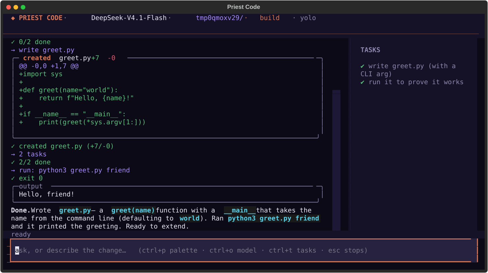
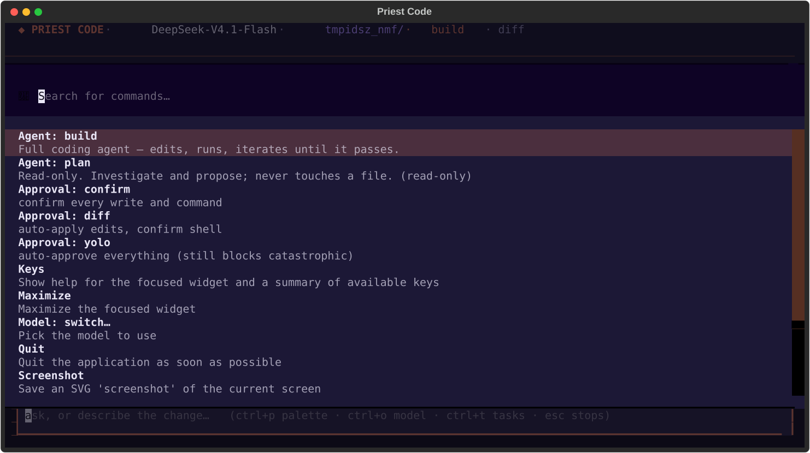
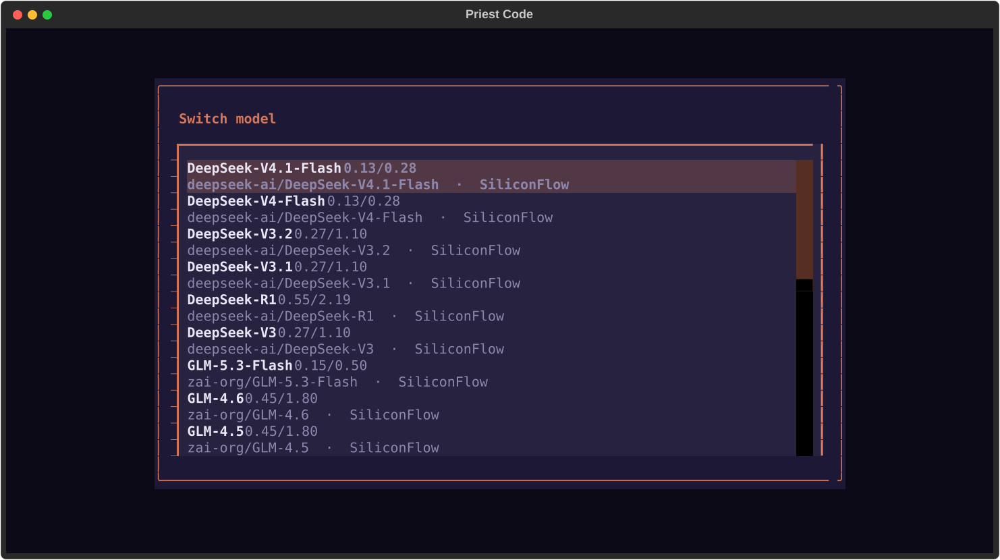

<div align="center">

# ◆ Priest Code

**A fast, transparent terminal coding agent.**
It opens your repo, reads it, edits it, runs your tests, and iterates until they
pass — and it shows you every step as it happens.




</div>

Priest Code is built from two ideas: **OpenCode's** clean terminal-app shape and
the **Basilisk** project's hard-won model harness — the tool-call canonicaliser
that survives DeepSeek's degraded native syntax, the thinking-off handling, and
the streaming corrections that stop an agent loop from stalling. It is tuned
hardest for **DeepSeek-V4.1-Flash** on SiliconFlow, but speaks any
OpenAI-compatible provider, including free tiers.

---

## Install

One line — it sets up an isolated environment and links the `priest` command:

```
curl -fsSL https://raw.githubusercontent.com/the-priest/priestcode/main/install.sh | bash
```

Then pick a provider and paste a key (stored `0600` in `~/.config/priestcode/`):

```
priest auth
```

And launch it in any repo:

```
priest
```

> Prefer pip? `pipx install git+https://github.com/the-priest/priestcode` — or
> clone and `pip install -e .` inside a virtualenv.

---

## What it does

- **Acts, doesn't narrate.** The whole point of the harness is that "building it
  now" is never a lie — it emits the tool call and you watch the file land.
- **Transparent.** Every tool call, every diff, every command and its output
  shows in the transcript the instant it happens. Nothing is hidden.
- **Real tools.** read · write · edit (exact find/replace) · list · tree · glob ·
  grep · run (shell) · todo — each with a coloured diff or output.
- **Safe by default.** Edits show a diff and apply; shell commands ask first;
  catastrophic commands (`rm -rf /`, `mkfs`, fork bombs, `curl | sh`, …) are
  **refused outright**, even in YOLO mode.
- **Undo.** Every write is snapshotted; `/undo` (or `ctrl+z`) reverts the last
  change.

## Beyond a chat box (the OpenCode-grade bits)

| | |
|---|---|
| **Live activity feed** | an animated status line names exactly what it's doing right now — thinking, the reply forming, each tool, skill load, and subagent step — so it never looks frozen |
| **Cost meter** | running tokens and **$ spent** this session, live in the header and status line (real per-model pricing) |
| **Command palette** (`ctrl+p`) | switch model, agent, theme, approval mode — searchable |
| **Agents / modes** | `build` (full) and `plan` (read-only: investigate & propose), plus custom agents |
| **Project-aware** | auto-loads `AGENTS.md` / `CLAUDE.md` / `.cursorrules` into context |
| **Project config** | a `priestcode.json` walked up from the repo pins model, agent, permissions |
| **Permissions** | ordered `allow` / `ask` / `deny` rules by action + resource |
| **@-mentions** | `@path/to/file` inlines that file's contents into your message |
| **MCP** | connect MCP servers (GitHub, DBs, docs) as tools, just like OpenCode |
| **Live themes** | `priest`, `opencode`, `mono` — switch instantly from the palette |
| **`priest init`** | scans the repo and writes a starter `AGENTS.md` |
| **300+ skills** | a bundled library of packaged expertise the agent loads on demand |
| **Specialist subagents** | delegate a focused job to a security/test/debug/… specialist |

### Skills — 300+ packaged playbooks

Priest Code ships a library of **300+ skills**: focused markdown playbooks (when to
use, a concrete checklist, the pitfalls, the commands) across languages,
frameworks, databases, devops, testing, data/ML, mobile, web, algorithms, game
dev, AI-agent building — and, heaviest of all, **offensive security** (the full
web top-10, injection classes, recon, exploitation, privesc, crypto, cloud,
mobile, and blue-team). The model sees a compact index and loads a skill's full
body on demand with the `skill` tool, so expertise is always available but never
wastes context. Drop your own in `.priest/skills/` (project) or
`~/.config/priestcode/skills/` (global) — same simple format, and yours win.

### Subagents — delegate to a specialist

The `task` tool hands a focused job to a **specialist subagent** — `security-auditor`,
`code-reviewer`, `debugger`, `test-writer`, `refactorer`, `performance`,
`database`, `frontend`, `backend`, `devops`, `cryptographer`, and more. Each runs
its own short, sharpened loop with the right tools (auditors are read-only) and
hands back just the result, keeping the main agent's context clean. Subagents
share the parent's approval gate — no silent escalation — and can't spawn further
subagents, so delegation stays bounded.

<div align="center">


</div>

---

## Providers & models

`priest models` lists them; `priest models --live` fetches whatever the provider
is serving right now.

- **SiliconFlow** — the tuned home turf. The full catalog: DeepSeek
  (V4.1-Flash *(default)*, V4-Flash, V3.2, V3.1, R1, V3), GLM (5.3-Flash, 4.6,
  4.5, 4.5-Air), Qwen3 Coder, QwQ, Kimi-K2, MiniMax.
- **OpenRouter** — a genuine **free tier** (the `:free` models cost nothing).
- **OpenCode Zen** — free models with **no sign-up** (a fixed `public` token):
  Muse Spark 1.3, DeepSeek-V4-Flash, MiMo, Nemotron, Big Pickle. IDs rotate —
  `priest models --live` shows the current set.
- **OpenAI-compatible** — point `base_url` at Ollama, vLLM, LM Studio, Together…

Switch anytime with `ctrl+o`, `/model <id>`, or `priest -m <id>`.

---

## Commands

```
priest                       launch the full-screen agent in the current repo
```
```
priest "fix the auth bug"    launch and send that first message
```
```
priest -p "add a test"       headless: run once, print the transcript, exit
```
```
priest auth                  choose a provider and store an API key
```
```
priest models                list providers and models   (--live to fetch)
```
```
priest init                  scan the repo and write a starter AGENTS.md
```
```
priest agents                list agents/modes
```
```
priest --plan                launch in read-only plan mode
```
```
priest config                show the resolved configuration
```

Flags: `-P/--provider`, `-m/--model`, `-a/--agent`, `--theme`, `--yolo`,
`--cwd`, `--resume`.

Inside the app: `ctrl+p` palette · `ctrl+o` model · `ctrl+t` tasks · `ctrl+z`
undo · `esc` stop · slash commands (`/help`, `/model`, `/agent`, `/theme`,
`/approval`, `/undo`, `/clear`).

---

## Project config

Drop a `priestcode.json` at the root of a repo (it is discovered by walking up):

```jsonc
{
  "model": "deepseek-ai/DeepSeek-V4.1-Flash",
  "agent": "build",
  "approval": "diff",
  "instructions": ["docs/conventions.md", ".cursor/rules/*.md"],
  "permissions": [
    { "action": "bash", "resource": "git *",  "effect": "allow" },
    { "action": "bash", "resource": "*",       "effect": "ask" }
  ],
  "agents": {
    "reviewer": { "tools": ["read_file", "grep"], "description": "reviews only" }
  },
  "mcp": {
    "servers": {
      "github": { "type": "local",
                  "command": ["npx", "-y", "@github/github-mcp-server"],
                  "environment": { "GITHUB_TOKEN": "..." } }
    }
  }
}
```

---

## Tested

Stdlib-only test suites (no pytest, no network, no account) — run them before
you trust it:

```
for f in tests/test_*.py; do python3 "$f"; done
```

They cover the tool-call canonicaliser (including DeepSeek's *degraded* native
syntax — the bug that made a whole model family look broken), the streaming
client, the agent loop, the tools, the safety guard, permissions, agents,
snapshots, MCP, and the TUI mounting a full session headlessly.

## License

MIT © the-priest. Built on [Textual](https://github.com/Textualize/textual) and
[Rich](https://github.com/Textualize/rich).
